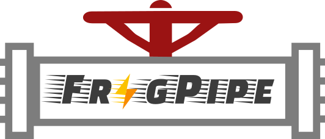

  

<div align="center">

</div>

FragPipe is a Java Graphical User Interface (GUI) for a suite of computational tools enabling comprehensive analysis of mass spectrometry-based proteomics data. It is powered by [MSFragger](https://msfragger.nesvilab.org/) - an ultrafast proteomic search engine suitable for both conventional and "open" (wide precursor mass tolerance) peptide identification. FragPipe includes the [Philosopher](https://nesvilab.github.io/philosopher/) toolkit for downstream post-processing of MSFragger search results (PeptideProphet, iProphet, ProteinProphet), FDR filtering, label-based quantification, and multi-experiment summary report generation. [Crystal-C](https://www.nesvilab.org/Crystal-C/) and [PTM-Shepherd](https://github.com/Nesvilab/PTM-Shepherd) are included to aid interpretation of open search results. Also included in FragPipe binary are [TMT-Integrator](http://tmt-integrator.nesvilab.org/) for TMT/iTRAQ isobaric labeling-based quantification, [IonQuant](http://ionquant.nesvilab.org/) for label-free quantification with FDR-controlled match-between-run (MBR) functionality, spectral library building with EasyPQP, and MSFragger-DIA and DIA-Umpire SE modules for direct analysis of data independent acquisition (DIA) data. 


### [Download](https://github.com/Nesvilab/FragPipe/releases)

#### FragPipe tutorials
* [Using FragPipe](https://fragpipe.nesvilab.org/docs/tutorial_fragpipe.html) (general tutorial covering all FragPipe modules)
* [Running FragPipe in command line interface](https://fragpipe.nesvilab.org/docs/tutorial_headless.html)
* PTM discovery
  * [Open search](https://fragpipe.nesvilab.org/docs/tutorial_open.html)
  * [Mass offset search](https://fragpipe.nesvilab.org/docs/tutorial_offset.html)
  * [Labile PTM search](https://fragpipe.nesvilab.org/docs/tutorial_labile.html)
  * [Glycoproteomics search](https://fragpipe.nesvilab.org/docs/tutorial_glyco.html)
  * [Custom mass offset workflow (RNA crosslinking example)](https://fragpipe.nesvilab.org/docs/tutorial_custom_mass_offset.html) 
  * [Diagnostic ion mining](https://fragpipe.nesvilab.org/docs/tutorial_diagnostic_mining.html)
  * [FPOP](https://fragpipe.nesvilab.org/docs/tutorial_fpop.html)
  
* TMT/iTRAQ quantification
  * [Single plex](https://fragpipe.nesvilab.org/docs/tutorial_tmt.html)
  * [Multiple plexes with a pooled reference sample](https://fragpipe.nesvilab.org/docs/tutorial_tmt-2plexes.html)
  * [Streamlined activity-based protein profiling of reactive cysteines (SLC-ABPP)](https://fragpipe.nesvilab.org/docs/tutorial_abpp.html)
* [Label-free quantification](https://fragpipe.nesvilab.org/docs/tutorial_lfq.html)
* [SILAC (or other MS1-labeled) data](https://fragpipe.nesvilab.org/docs/tutorial_silac.html)
* [DIA analysis](https://fragpipe.nesvilab.org/docs/tutorial_DIA.html)

#### Resources
* [Interpreting output files](https://fragpipe.nesvilab.org/docs/tutorial_fragpipe_outputs.html)
* [List of built-in workflows](https://fragpipe.nesvilab.org/docs/tutorial_fragpipe_workflows.html)
* [FragPipe setup](https://fragpipe.nesvilab.org/docs/tutorial_setup_fragpipe.html)
* [Converting LC/MS data files to mzML](https://fragpipe.nesvilab.org/docs/tutorial_convert.html)
* [Setting up FragPipe on remote Linux server (with X forwarding)](https://fragpipe.nesvilab.org/docs/tutorial_setup_x_forwarding.html)

#### Using FragPipe with other tools
* [Running MSstats with IonQuant results](https://fragpipe.nesvilab.org/docs/tutorial_msstats.html)
* [Importing results into Skyline](https://fragpipe.nesvilab.org/docs/tutorial_skyline.html)
* [Importing results into Perseus](https://fragpipe.nesvilab.org/docs/tutorial_perseus.html)


#### Supported instruments and file formats  
The table below shows the compatibility of FragPipe workflow components with different spectral file formats.

_Bruker .d indicates ddaPASEF files from timsTOF, other Bruker .d files should be converted to .mzML. Please also note that timsTOF data requires [Visual C++ Redistributable for Visual Studio 2017](https://aka.ms/vs/16/release/VC_redist.x64.exe) in Windows. If you see an error saying cannot find Bruker native library, please try to install the Visual C++ redistibutable._


_DIA data acquired with overlapping/staggered windows must be [converted to mzML with demultiplexing](https://fragpipe.nesvilab.org/docs/tutorial_convert.html#convert-thermo-dia-raw-files-with-overlappingstaggered-windows)._
_Quantification from Thermo .raw files with DIA-NN requires installation of Thermo MS File Reader, see the [DIA-NN documentation](https://github.com/vdemichev/DiaNN#raw-data-formats) for details._

Please note TMT/iTRAQ quantification from Thermo .raw files will take longer than from .mzML files.


#### Additional Documentation
Complete MSFragger documentation can be found on the [MSFragger wiki](https://github.com/Nesvilab/MSFragger/wiki).
For documentation on the Philosopher toolkit see the [Philosopher wiki](https://github.com/Nesvilab/philosopher/wiki).

#### Questions and Technical Support
View previous questions/bug reports in the
[FragPipe issue tracker](https://github.com/Nesvilab/FragPipe/issues). Please post any new questions/bug reports regarding FragPipe itself here as well.
For questions specific to individual components of FragPipe you can also
use [MSFragger issue tracker](https://github.com/Nesvilab/MSFragger/issues),
[Philosopher issue tracker](https://github.com/Nesvilab/philosopher/issues),
[IonQuant issue tracker](https://github.com/Nesvilab/IonQuant/issues).
See the MSFragger [wiki](https://github.com/Nesvilab/MSFragger/wiki) and [FAQ](https://github.com/Nesvilab/MSFragger/wiki/Frequently-Asked-Questions). 


For other tools developed by Nesvizhskii lab, visit our website 
[nesvilab.org](http://www.nesvilab.org)

#### How to Run
- **Windows**:
  - Run the Windows executable (*.exe*) from the "bin" folder
  - Or start the `FragPipe.bat` from the *.zip* distribution  
  or execute one of the following commands:
  - `start javaw -jar FragPipe-x.x.jar`
  - `java -jar FragPipe-x.x.jar`
- **Linux**:
  - Run the `fragpipe` shell script (can double-click to run)  
  or execute the following command:
  - Or execute `java -jar FragPipe-x.x.jar`
 
#### Integration
FragPipe is open source and the output is currently supported by the following software projects:
- [Skyline](https://skyline.ms/project/home/software/Skyline/begin.view)
- [AlphaPeptDeep](https://github.com/MannLabs/alphapeptdeep)
- [AlphaPeptStats](https://github.com/MannLabs/alphapeptstats)
- [AlphaMap](https://github.com/MannLabs/alphamap)
- [directLFQ](https://github.com/MannLabs/directlfq)
- [DIA-NN](https://github.com/vdemichev/DiaNN)
- [MSstats](http://msstats.org/)
- [picked_group_fdr](https://github.com/kusterlab/picked_group_fdr)
- [FragPipe-Analyst](http://fragpipe-analyst.nesvilab.org/)


#### Cite
- Kong, A. T., Leprevost, F. V., Avtonomov, D. M., Mellacheruvu, D., & Nesvizhskii, A. I. (2017). MSFragger: ultrafast and comprehensive peptide identification in mass spectrometry–based proteomics. Nature Methods, 14(5), 513-520.
- Yu, F., Teo, G. C., Kong, A. T., Haynes, S. E., Avtonomov, D. M., Geiszler, D. J., & Nesvizhskii, A. I. (2020). Identification of modified peptides using localization-aware open search. Nature Communications, 11(1), 1-9.
- Polasky, D. A., Yu, F., Teo, G. C., & Nesvizhskii, A. I. (2020). Fast and Comprehensive N-and O-glycoproteomics analysis with MSFragger-Glyco. Nature Methods, 17, 1125-1132.
- Chang, H. Y., Kong, A. T., da Veiga Leprevost, F., Avtonomov, D. M., Haynes, S. E., & Nesvizhskii, A. I. (2020). Crystal-C: A computational tool for refinement of open search results. Journal of Proteome Research, 19(6), 2511-2515.
- Geiszler, D. J., Kong, A. T., Avtonomov, D. M., Yu, F., da Veiga Leprevost, F., & Nesvizhskii, A. I. (2020). PTM-Shepherd: analysis and summarization of post-translational and chemical modifications from open search results. Molecular & Cellular Proteomics.
- da Veiga Leprevost, F., Haynes, S. E., Avtonomov, D. M., Chang, H. Y., Shanmugam, A. K., Mellacheruvu, D., Kong, A. T., & Nesvizhskii, A. I. (2020). Philosopher: a versatile toolkit for shotgun proteomics data analysis. Nature Methods, 17(9), 869-870.
- Yu, F., Haynes, S. E., Teo, G. C., Avtonomov, D. M., Polasky, D. A., & Nesvizhskii, A. I. (2020). Fast quantitative analysis of timsTOF PASEF data with MSFragger and IonQuant. Molecular & Cellular Proteomics.
- Yu, F., Haynes, S. E., & Nesvizhskii, A. I. (2021). IonQuant enables accurate and sensitive label-free quantification with FDR-controlled match-between-runs. Molecular & Cellular Proteomics, 20.
- Teo, G. C., Polasky, D. A., Yu, F., Nesvizhskii, A. I. (2020). A fast deisotoping algorithm and its implementation in the MSFragger search engine. Journal of Proteome Research.
- Tsou, C. C., Avtonomov, D., Larsen, B., Tucholska, M., Choi, H., Gingras, A. C., & Nesvizhskii, A. I. (2015). DIA-Umpire: comprehensive computational framework for data-independent acquisition proteomics. Nature methods, 12(3), 258-264.

##### Building from scratch

1. Update build version:  
The version of the build is stored in 3 separate places:  
    - File: `MSFragger-GUI/src/umich/msfragger/gui/Bundle.properties`  
      Property: `msfragger.gui.version`
    - File: `MSFragger-GUI/build.gradle`  
      Property: `version`
    - File: `MSFragger-GUI/src/umich/msfragger/gui/Bundle.properties `  
      Property: `msfragger.gui.version`
2. Build:  
You don't need to have Gradle installed, the Gradle wrapper included in this repository will be used. From the root directory of the repository issue the following commands:

    ```bash
    cd ./MSFragger-GUI
    ./gradlew makeReleaseZipNoJre
    ```
    or use this version to build with Java Runtime (for Windows only):
    
    ```bash
    cd ./MSFragger-GUI
    ./gradlew makeReleaseZipWithJre
    ```
    
3. The .zip output will be in `MSFragger-GUI/build/github-release`.
