Last update: Jan 7, 2026

# Quality control figures
During transfer learning, PSMs are split 80-20 into training and holdout test sets. The training set is further split 90-10 into training and validation sets. Various plots elucidate the outcome of the transfer learning process.

## Score distributions
Violinplots show prediction accuracy before and after transfer learning, with dashed lines indicating 25th, 50th, and 75 percentiles. PSMs/peptides are split by PTM status (a PSM/peptide with phosphorylation and acetylation will be counted in both groups). MS2 similarity is reported in cosine similarity, absolute RT difference in normalized RT units (between 0 and 1), and CCS difference in Angstroms squared. A sample size if provided below each subgroup. Two plots are generated for each predicted property, for the training and holdout testing sets.

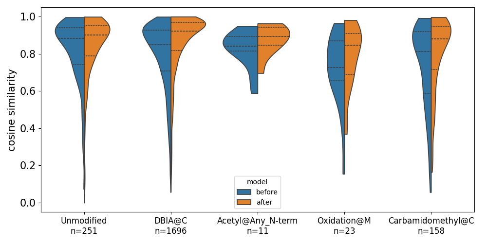
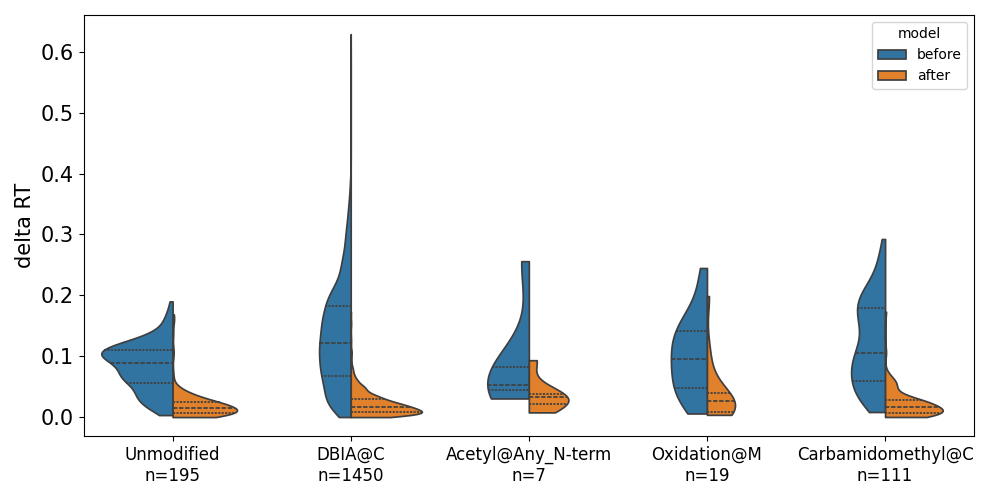
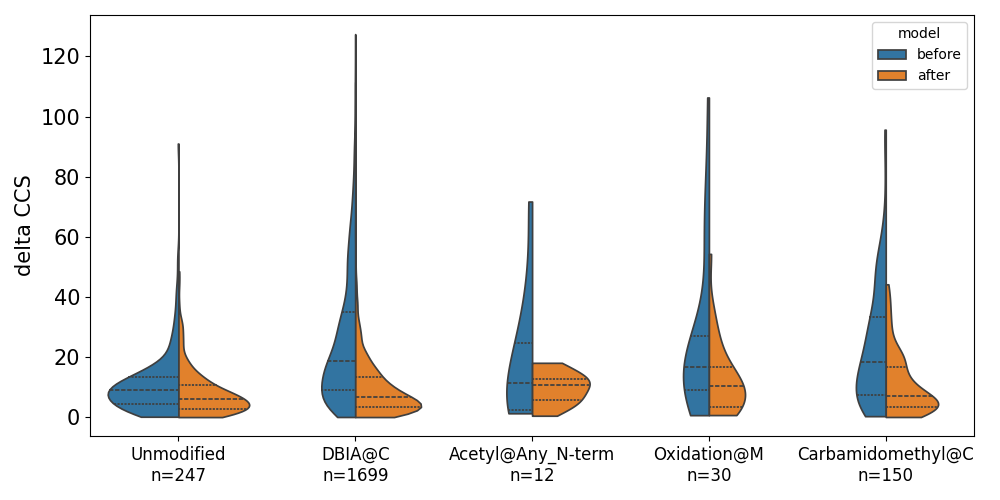

## Improvement in largest deviating peptides/PSMs
Scatterplots divided by PTM for the testing set show the performance of individual datapoints, and in particular those with the largest RT/CCS deviations and lowest MS2 similarities. RT/CCS plots have color-coding based on the actual values. A dotted black line of x=y divides the figure into two halves, with points lying further from the line showing greater changes in prediction. A dotted grey vertical line denotes the median delta RT/CCS or MS2 similarity score using predictions before transfer learning, and a percent is calculated for each PTM subgroup for what percent of points in the bottom half of performers see improvement after transfer learning.
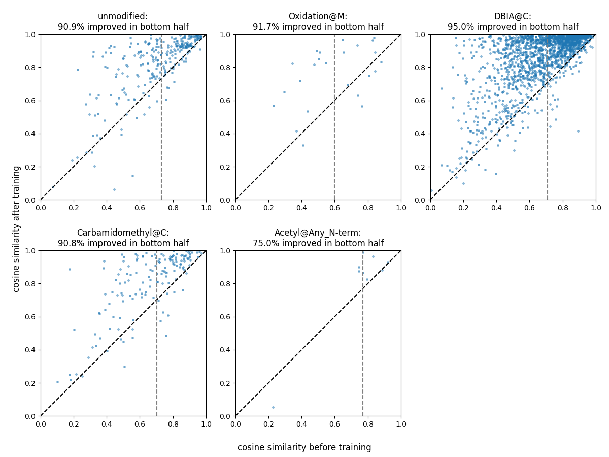
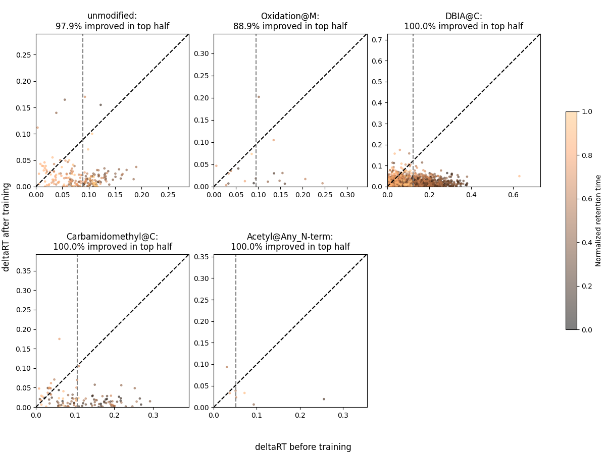
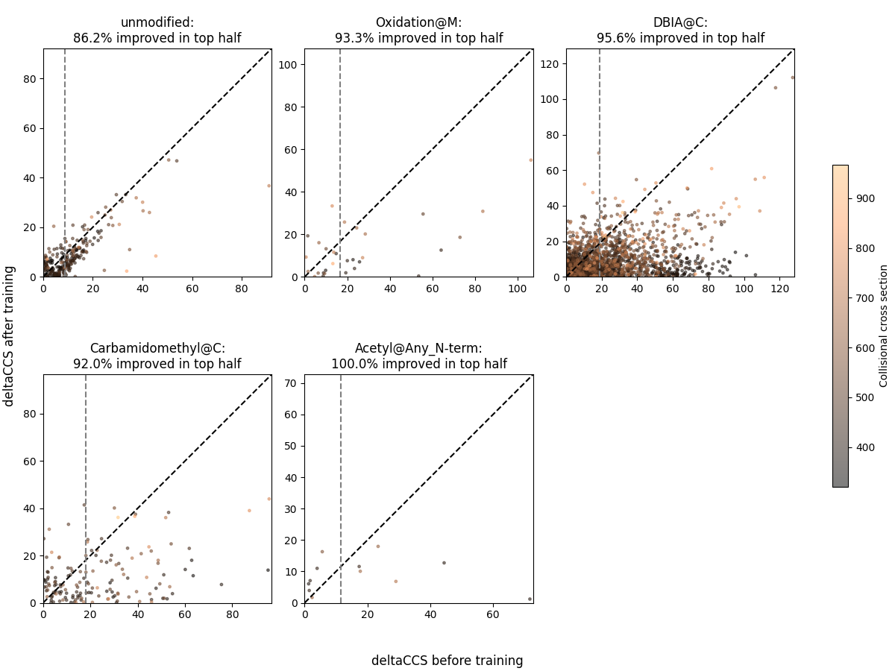

## Delta histograms
Histograms show the change in MS2 similarity and delta RT/CCS after transfer learning. Positive changes in MS2 similarity and negative changes in delta RT/CCS denote improvement, and the number of improved PSMs/peptides is provided for each distinct PTM. A grey dotted vertical line denotes the location of zero change. A cumulative distribution function is plotted in red. Figures are produced for the training and test sets.
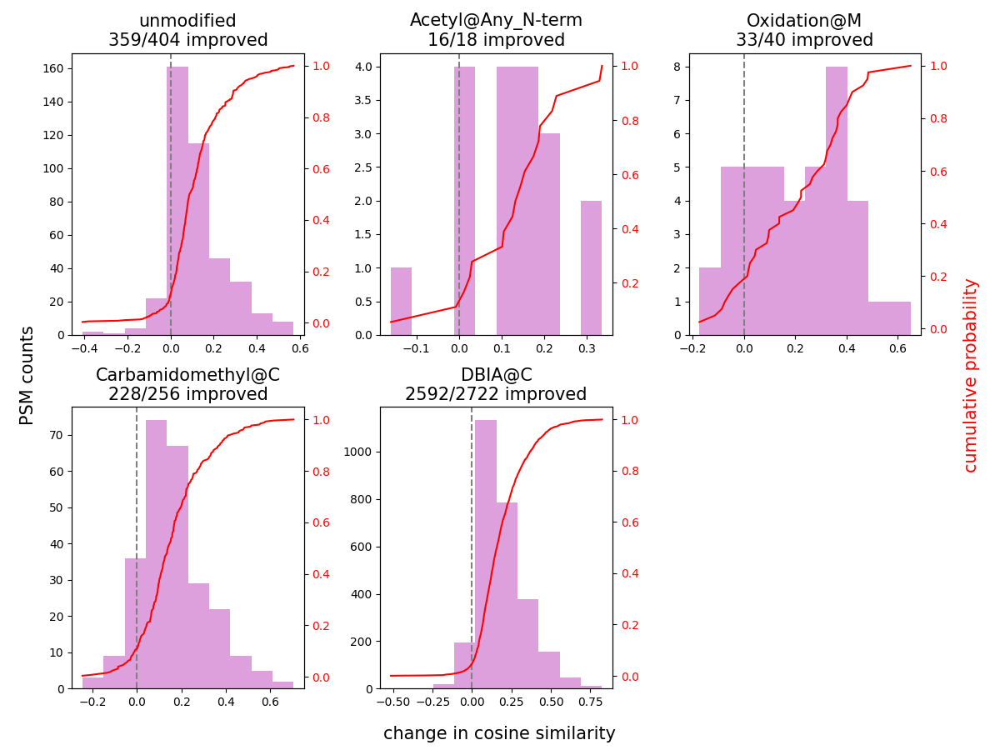
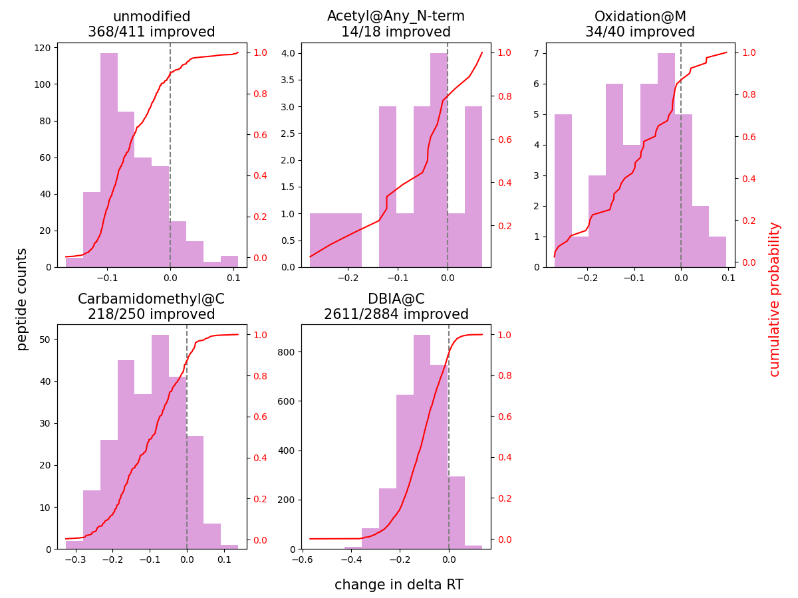
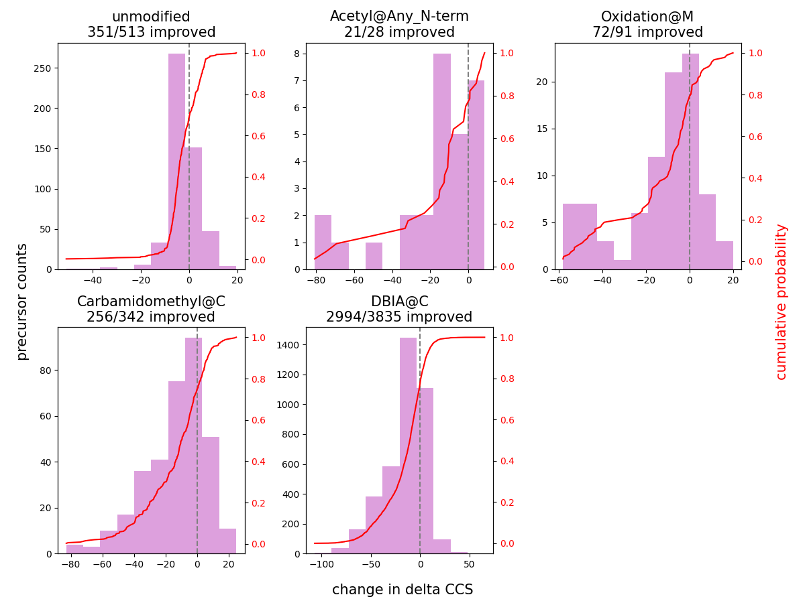

## Alignment plots
RT and CCS show the alignment of observed/experimental and predicted values in the holdout testing set before and after transfer learning.

Pre training
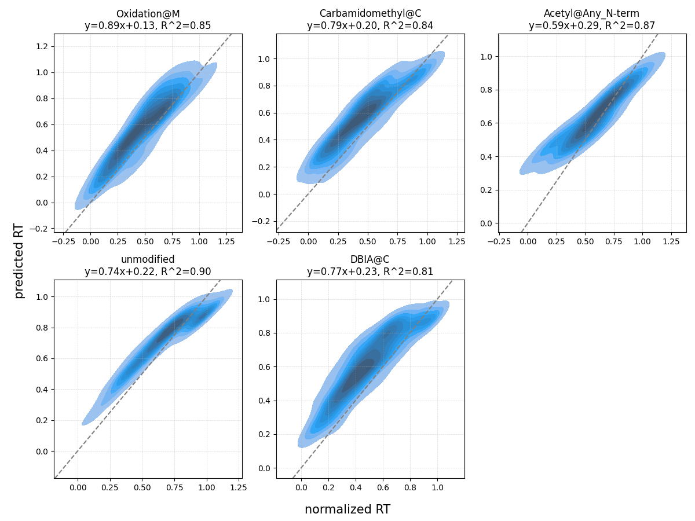
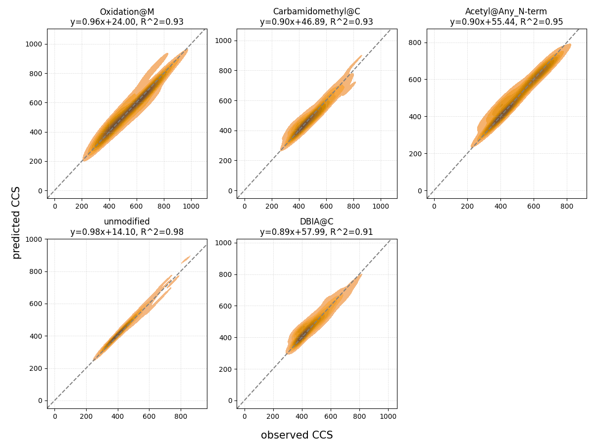

Post training
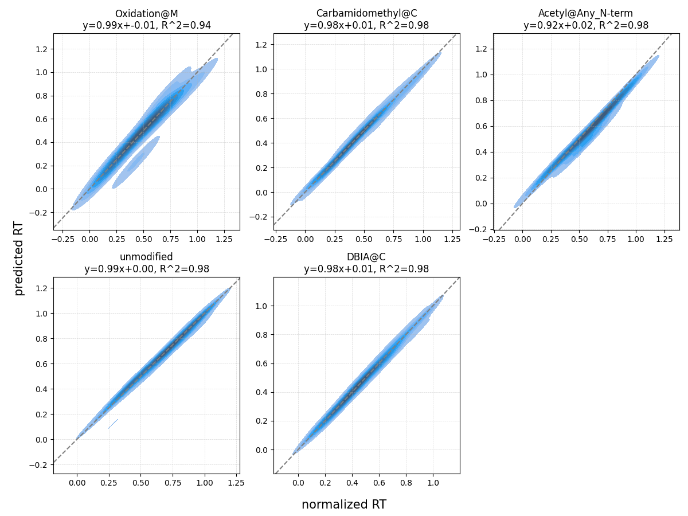
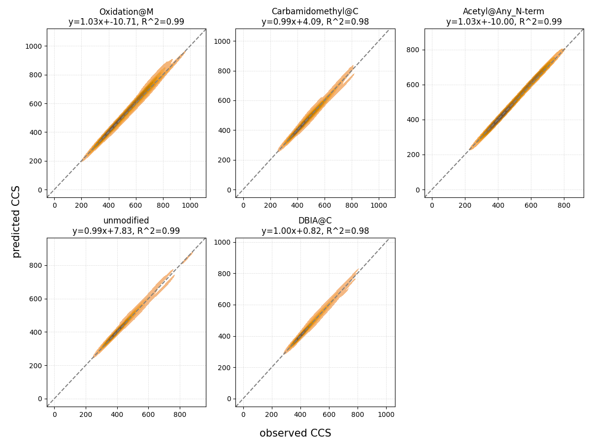

## Training loss
Loss on the training and validation sets is plotted across epochs. Early stopping is implemented if validation loss does not decrease after 5 epochs. The default AlphaPeptDeep L1 loss function is used for all predicted properties

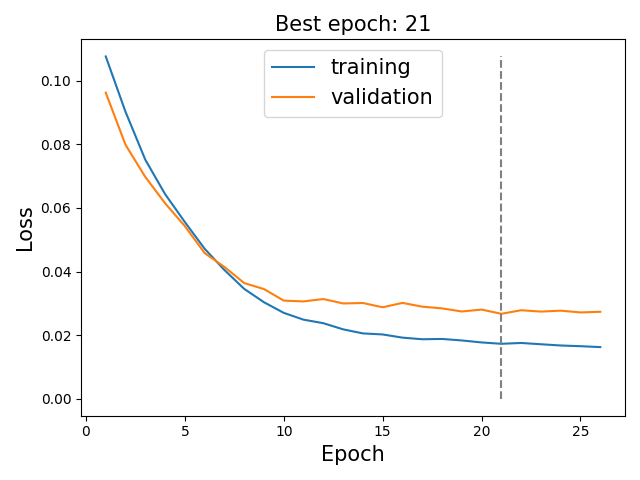