Last update: Mar 2, 2026

# Transfer Learning: peptide candidates, spec lib usage, and decoy handling
A variety of peptide property prediction models ae available in FragPipe, namely DIA-NN and those on the
[Koina server](https://github.com/Nesvilab/MSBooster/blob/master/Koina.md). Though trained on various datasets, these 
models may not know the nuances of your machine or PTMs of interest. Transfer learning takes a base model that knows
the general rules of peptide fragmentation, liquid chromotography, and ion mobility and adapts it on a new dataset. This
has the potential to improve DDA identifications and DIA quantification, the latter of which was limited in previous 
FragPipe editions to only quantifying FDR-filtered peptide candidates from empirically generated libraries. Our transfer
learning relies upon the [AlphaPeptDeep transfer learning module](https://github.com/MannLabs/alphapeptdeep).

---

## First steps
There are two options for running FragPipe transfer learning: using our FragPipe public server or setting up a private server.
**An AWS server is also in development.** Please direct all requests for access to the public/private servers to nesvi[AT]med.umich.edu
if you are an academic user or nesvi[AT]fragmatics.com if you are a commercial user.

### Public server
Please contact us to generate an API key for you.

### Private server
Please contact us for access to [this tutorial page](https://github.com/Nesvilab/FragPipe_transfer_learn/tree/main)
for instructions on setting up your own Docker instance. Once the server is up, you must generate your own credential file.
This file, ending with the ".key" extension, has two lines, the server URL and API key. The API key can be generated via 
cURL request. Below is an example credential key file.

```
http://localhost:8000
apikey-123
```
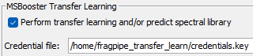
---

## Peptide candidate sources

Predicted libraries can be generated from different peptide candidate sources:

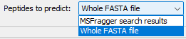

### 1. Whole FASTA
- Peptides are generated by applying **digestion rules from the MSFragger tab**

  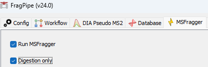
- Used when broad peptide coverage is desired
- The minimum and maximum precursor charges can be configured

  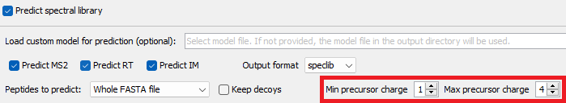

### 2. Restricted candidates (MSFragger search results)
- Peptides are taken **directly from MSFragger PIN files**
- **Digestion parameters are ignored**
- Only peptides observed in the MSFragger search are included

---

## Using an existing library or pre-trained weights

Many of the FragPipe workflows have **Spec Lib** enabled, which generates a library.tsv in the output directory. Once you 
have a `library.tsv` file or pre-trained transfer-learning weights (e.g. from a previous transfer learning job):

- A full MSFragger search is **not required**
- **MSFragger: OFF**
- **Validation tab: OFF**
- Enable **“Digestion only”** in the MSFragger tab (if using Whole FASTA)

Libraries and weights not generated in FragPipe can be used if they follow the appropriate format. Refer to the
[tutorial](https://github.com/Nesvilab/FragPipe_transfer_learn/tree/main/data) for the proper format

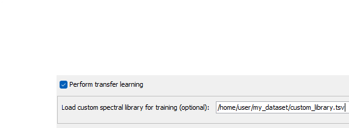

## Outputs
Transfer learning will return a zip file with all model weights and a subfolder containing 
[quality control metrics](./transfer_learning_QCfigures). 
There is no need to unzip the zip folder in our workflows, as the prediction script automatically unzips it.

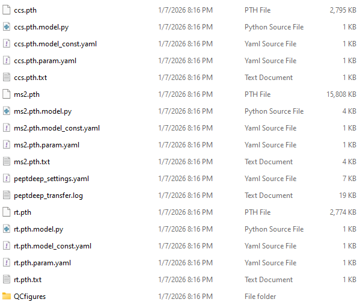

The prediction step supports many output format: speclib (DIA-NN specific format), library.tsv, parquet, and mgf. The
parquet follows the standard library.tsv format. Library.tsv is the current default for our workflows, and we are actively
testing the suitability of the speclib format for our workflows. **We highly recommend using library.tsv format if uploading
to DIA-NN.** Other formats may produce unexpected results in DIA-NN.

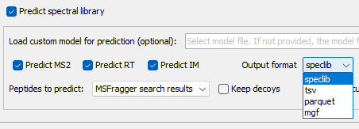

---

## Decoy handling

- **Keep decoys ON**
    - Required when the predicted library will be used for **MSBooster rescoring**

- **Keep decoys OFF**
    - Required when the predicted library will be used for **DIA quantification in DIA-NN**
    - DIA-NN regenerates decoys internally

      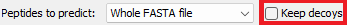
---

## Custom modifications

Modifications not in UniMod will need to be specified via a comma-separated string in FragPipe for both transfer learning 
and prediction. Each modification entry will be in the form \<mod_name@AA,composition,modloss_composition,mod_mass>.
"(modloss_)composition" is the atomic composition in the form AA(# of atoms) and "mod_mass" is monoisotopic.
**Modification losses will be supported soon.**

`Custom1@N,C(88)H(146)N(2)O(70),,2026.687`

If a modification is localized to multiple amino acids in the training library or prediction file, a separate entry 
must be specified for each. Multiple entries, whether from different modifications or different localizations, must be
separated with semicolons.

`Custom1@N,C(88)H(146)N(2)O(70),,2026.687;Custom1@A,C(88)H(146)N(2)O(70),,2026.687`

N-terminal mods are `@n`, C-terminal `@c`

`Custom2@n,C(1)O(-1),,-3.9949`

The atomic composition does not consider different isotopes. As an example, light and medium 
(H(12)C(4)13C(3)N(1)15N(1)O(1)) mTRAQ labels would share the same atomic composition here:

`Custom3_light@K,H(12)C(7)N(2)O(1),,140.09;Custom3_medium@K,H(12)C(7)N(2)O(1),,144.10`

___

## Common transfer learning workflows

### Overview and assumptions
Transfer learning in FragPipe can be run **with or without a full MSFragger search**, depending on:

- whether a **training spectral library already exists**
- how peptide candidates for prediction are defined
- how the predicted library will be used downstream (MSBooster, DIA-NN, etc.)

**Important assumptions**

Transfer learning requires a **training spectral library** (typically generated via **MSFragger → Validation → Spec Lib / EasyPQP**).
We present a few workflows that can server as templates for your use case.

- **Workflows A–C below assume this training library already exists**
- **Workflow D** describes the full end-to-end case starting directly from raw MS data

The below image summarizes how transfer learning fits into our pipeline. Subsequent workflow sections will show adapted
images.

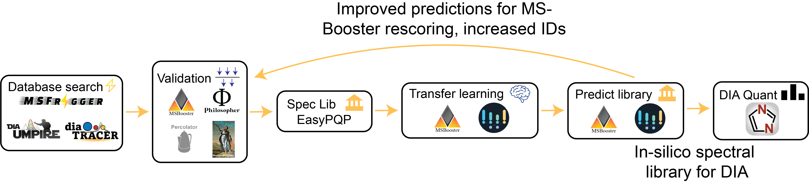

### Workflow A — DDA-only MSBooster rescoring

**Goal:** Improve DDA peptide identification using a transfer learned model

This can also be use for DIA data, if the goal is not quantification but only identification

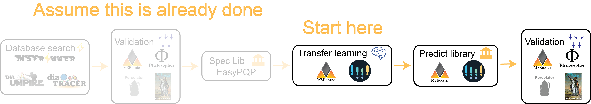

**Execution steps:**

0.  Load your training library. An externally generated training library can be provided in the "Load custom spectral 
library for training (optional)" box in the **Transfer Learning** tab. If you are picking up from the end of a FragPipe 
workflow with **Spec Lib** generation enabled, a `library.tsv` should already be in your output directory and you can
leave the box blank. If diaTracer was used, replace the .d files with _diatracer.mzml files in the Workflow tab.
1. Run **Transfer Learning** and **prediction** to predict a spectral library. Set "Output format" to speclib or tsv
2. Reload (or duplicate) the DDA search workflow
    - Load the predicted library into **MSBooster** "Spectral library (optional, experimental) box"
    - **MSFragger: OFF**
    - Rerun with MSBooster rescoring and downstream Validation steps

**Settings for transfer learning and prediction (step 1)**
- MSFragger: OFF
- Validation: OFF
- Spec Lib: OFF
- Peptides to predict: MSFragger search results
- Keep decoys: **ON**

**Settings for rescoring (step 2)**
- MSFragger: OFF
- Validation: ON
- Spec Lib: OFF
- Transfer learning: OFF

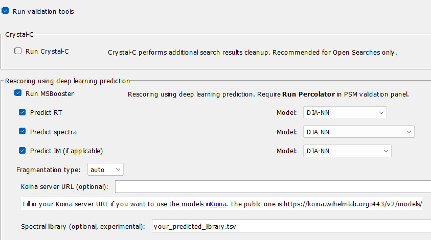
---

### Workflow B — DIA library prediction for DIA-NN

**Goal:** Generate a predicted spectral library for DIA analysis in DIA-NN  

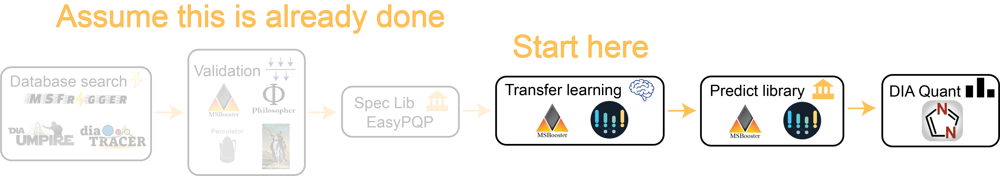

**Execution steps:**

0. Load your training library. An externally generated training library can be provided in the "Load custom spectral
    library for training (optional)" box in the **Transfer Learning** tab. If you are picking up from the end of a FragPipe
    workflow with **Spec Lib** generation enabled, a `library.tsv` should already be in your output directory and you can
    leave the box blank.
1. Run **Transfer Learning** and **prediction** to predict a spectral library. Set "Output format" to tsv
2. Run DIA quantification with the **Quant (DIA)** tab, specifying your new library in the "Spectral library (optional)"
box. Note that the DIA-NN tab can be checkmarked and run together with transfer learning in one go. It is described in 
this separate step for sake of clarity

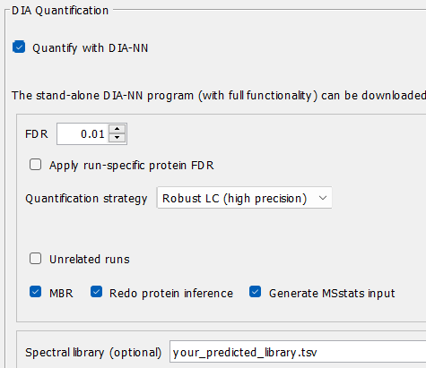

**Settings for transfer learning and prediction (step 1)**
- DIA Pseudo MS2 OFF (if DIA-Umpire or diaTracer were used)
- MSFragger: OFF
- Validation: OFF
- Spec Lib: OFF
- Peptide candidates: Whole FASTA or MSFragger search results
  - The choice of search space depends on if you want more peptides/proteins to quantify outside of those 
  identified by MSFragger
- Keep decoys: **OFF**
  - DIA-NN regenerates decoys internally.

---

### Workflow C — Iterative MSBooster → new predicted DIA library
This is a combination of workflows A and B. The idea is that if MSBooster is given improved predictions, PSM rescoring
by Percolator is improved, generating more IDs at a given FDR threshold. More IDs = more training points for the 
transfer learning

**Goal:** Improve IDs via MSBooster and regenerate a refined predicted library

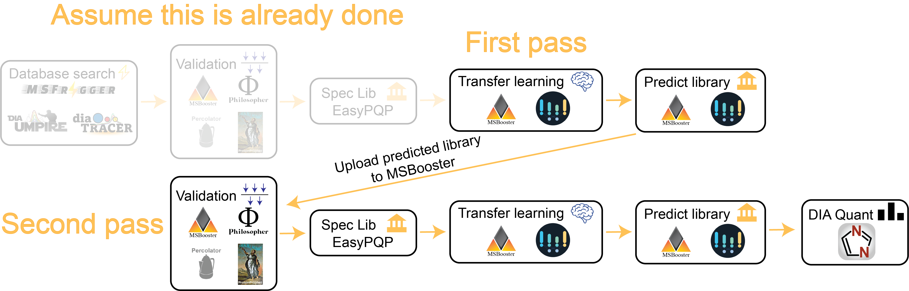

**Execution steps:**

0. Load your training library. An externally generated training library can be provided in the "Load custom spectral
   library for training (optional)" box in the **Transfer Learning** tab. If you are picking up from the end of a FragPipe
   workflow with **Spec Lib** generation enabled, a `library.tsv` should already be in your output directory and you can
   leave the box blank. If diaTracer was used, replace the .d files with _diatracer.zml files in the Workflow tab.
1. Run **Transfer Learning** and **prediction** to predict your **initial spectral library**. Set "Output format" to speclib or tsv
2. Reload workflow and rerun search from **MSBooster** using the predicted library. Steps up through the second transfer
learning step can be rerun in one go, generating a second, improved predicted library. When predicting the second library, 
set "Output format" to tsv
    - Load the predicted library into **MSBooster** "Spectral library (optional, experimental) box"
3. Run DIA quantification with the **Quant (DIA)** tab, specifying your new library in the "Spectral library (optional)"
   box. If diaTracer was used, replace the _diatracer.mzml files with .d files in the Workflow tab. Note that the DIA-NN 
   tab can be checkmarked and run together with the previous tools in one go. It is described in this separate step for sake of clarity

**Settings for transfer learning and prediction (step 1)**
- DIA Pseudo MS2 OFF (if DIA-Umpire or diaTracer were used)
- MSFragger: OFF
- Validation: OFF
- Spec Lib: OFF
- Peptides to predict: MSFragger search results
- Keep decoys: **ON**

**Settings for rescoring and second transfer learning and prediction (step 2)**
- DIA Pseudo MS2 OFF (if DIA-Umpire or diaTracer were used)
- MSFragger: OFF
- Validation: ON
- Spec Lib: ON
- Transfer Learning: ON
  - Peptides to predict: Whole FASTA or MSFragger search results

---

### Workflow D — Full end-to-end workflow from raw MS data
Generate a training spectral library from a FragPipe first pass workflow (e.g. one of the workflow files
provided in FragPipe).
This is the generic use case. The ideas here about generating a training library (library.tsv) can be applied in step 0
of the previous workflows.

**Goal:** Train transfer learning weights and generate a predicted library starting from raw MS files

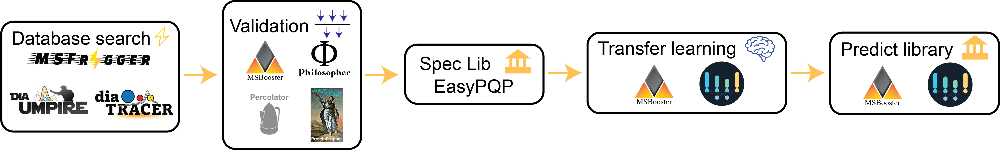

**Typical settings:**
- MSFragger: ON
- Validation: ON
- Spec Lib: ON
- Transfer learning: ON
- Peptide candidates: Whole FASTA or MSFragger search results
- Keep decoys: ON or OFF (depending on downstream use)

---

## Suggestions
### Using MSBooster for the first search
If you believe default prediction models may negatively impact your training library (e.g. chemically very
different PTMs not included in DIA-NN training set of n-term acetylation, methionine oxidation, cysteine carbamidomethylation,
phosphorylation, ubiquitinylation, and TMT), you can try turning off MSBooster in the Validation
tab when you generate your library. Enabling MSBooster may promote modified peptides that behave similarly
to their unmodified counterparts and penalize those with meaningful changes in spectra/retention time/ion
mobility. Once you have a model trained on non-MSBooster rescored candidates, you can upload the predictions into
MSBooster for improved rescoring. It is likely that more peptides will pass FDR in this second search, resulting in
more peptides for training a second model.

This suggestion always applies for MS2 spectral rescoring. If your data is enriched for the PTM of interest, then RT/IM
alignment will automatically be tuned for the modified peptides, so it is okay to turn on RT/IM rescoring. If the PTM
represents a small portion of the total PSMs, RT/IM alignment will focus on unmodified peptides, so one can consider 
skipping MSBooster entirely.

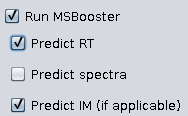

### Instrument and NCE
You can specify your instrument and normalized collision energy in the transfer learning tab. Training most likely will
still converge to accurate results even if you leave it at the default values, but the training may converge quicker and
be more accurate if they are defined properly.

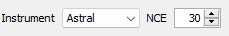

---

## Citations
- Yang, K.L., Yu, F., Teo, G.C. et al. MSBooster: improving peptide identification rates using deep learning-based features.
  Nat Commun 14, 4539 (2023). https://doi.org/10.1038/s41467-023-40129-9
- Zeng, WF., Zhou, XX., Willems, S. et al. AlphaPeptDeep: a modular deep learning framework to predict peptide properties 
for proteomics. Nat Commun 13, 7238 (2022). https://doi.org/10.1038/s41467-022-34904-3